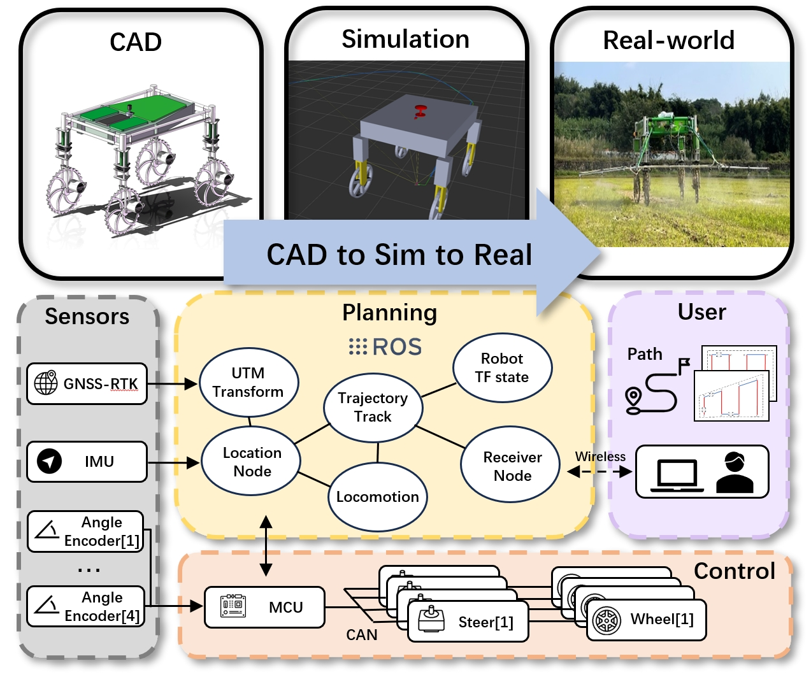

# An Open-Source Platform for Autonomous Navigation of 4WS-4WD Agricultural Robots with Omni-Directional Kinematics 

This repo contains code for our paper - 
#### [**An Open-Source Platform for Autonomous Navigation of 4WS-4WD Agricultural Robots with Omni-Directional Kinematics**]
*	Lebin Liang, Dewei Lu, Dong Li, Zilong Chen, Can Wang and Xinyu Wu*

## Overview




## Abstract
*Autonomous navigation in complex outdoor environments is essential for improving efficiency and reducing labor demands in agricultural applications. We presents an open-source 4-wheel steering and 4-wheel drive (4WS-4WD) agricultural autonomous navigation robot platform designed to address the maneuverability and terrain adaptability limitations of conventional robots. By using an omni-directional kinematic model, the system enhances mobility and terrain adaptability in agricultural environments. The system achieves high-precision localization and orientation feedback by integrating a GNSS-RTK receiver, an onboard IMU, and real-time steering angle encoders. The motion controller based on the omni-directional kinematic model ensures precise path tracking and excellent maneuverability. The system's performance is validated through both simulation and real-world deployment, evaluated using reference trajectories. Experimental results demonstrate the system's robustness and efficiency, achieving high-precision path tracking and reliable performance in real-world agricultural applications. All open-source materials, including CAD drawings, circuit boards, and code, can be accessed at the following repository: https://github.com/LebinLiang/four_ws_wd/tree/main*


## Installation 

To run this repository, you will need **ROS Noetic** with Python 3.8. First, set up a catkin workspace as outlined below.


### Catkin Workspace Setup
1. **Install ROS Noetic**  
   Follow the instructions on the official ROS documentation: [ROS Introduction](http://wiki.ros.org/ROS/Introduction).  

2. **Create a New Workspace**  
   Open a terminal and execute the following commands:  
   ```bash
   mkdir -p ~/catkin_ws/src
   cd ~/catkin_ws/
   ```
 3. **Initialize the Workspace**
    ```bash
    cd ~/catkin_ws/src
    catkin init
    ```
 4. **Clone the Repository**
    ```bash
    git clone git@github.com:LebinLiang/four_wd_ws.git
    ```
 5. **Build the Workspace**
  
    Compilation might require multiple attempts to resolve message dependencies.
    ```bash
    cd ~/catkin_ws
    catkin build
    ```
 6. **Set Up Environment Variables**
    ```bash
    source devel/setup.bash
    ```

    (Optional) Automatically source the workspace in every terminal session:
    ```bash
    echo "source ~/catkin_ws/devel/setup.bash" >> ~/.bashrc
    source ~/.bashrc
    ```
## Deployment Guide

This repository provides various automated scripts for launching core functionalities, located in the `/sh` folder.

**Available Scripts**
1. 0-Close-all-terminals.sh - Closes all open terminals.
2. 1-Start-Simulation.sh - Starts the simulation environment.
3. 2-Start-Vehicle-Functions.sh - Launches vehicle functionalities.
4. 3-Data-Collection.sh - Collects trajectory data.
5. 4-Generate-CSV.sh - Converts trajectory data into CSV format.

### Simulation Setup

 1. **(Optional) Enable or Disable Gazebo GUI**

    Modify the `gui` argument in the `4ws_car/launch/gazebo.launch` file:
    ```xml
      <arg name="gui" default="false"/>
    ```
  * Set `false` to disable the Gazebo GUI (default).
  * Set `true` to enable the GUI.

 2. **Start the Simulation** 

    Open a new terminal and run
    ```
    cd sh/
    sh 1-Start-Simulation.sh
    ```
 3. **Script Details** for ``1-Start-Simulation.sh``

    The script will automatically open two new terminal windows and an RViz visualization window:

  * Terminal 1: Outputs simulation localization data.
  * Terminal 2: Displays the navigation controller menu.
  * RViz Window: Used to set waypoints and visualize robot trajectories.

  Commands executed by the script:

  ```bash
  roslaunch taurus_control simulation.launch    # Launch simulation environment.
  roslaunch four_ws_navigation four_ws_navigation.launch # Start navigation controller.
  ```

### Real-World Experiments


**Hardware Prerequisites！！**

* A NUC computer connected to:
  * An IMU.
  * GNSS receiver.
  * Chassis embedded controller via serial port.

**Steps**

1. **Start Vehicle Functions**

    Open a new terminal and run:
    ```bash
    cd sh/
    sh 2-Start-Vehicle-Functions.sh
    ```
 2. **Script Details** for `2-Start Vehicle Functions.sh`

 The script automatically opens five terminal windows and one RViz visualization window, launching:

  * Sensor drivers.
  * Localization nodes.
  * Navigation controllers.
  * MAVLink communication nodes (TODO).
  * Serial communication nodes.

 Commands executed by the script:

```bash
roslaunch robot_launch launch_robot.launch         # Start robot sensor nodes.
roslaunch robot_launch launch_location.launch      # Start localization nodes.
roslaunch four_ws_navigation four_ws_navigation.launch # Start navigation controller.
roslaunch mavlink_ros mavlink.launch               # Start MAVLink communication nodes.
roslaunch simple_robot robot.launch                # Start serial communication nodes.
```

### Trajectory Modification & Data Collection

#### Modify Trajectories
 1. Edit predefined trajectories in the `four_ws_navigation.py` file located at:
`src/four_ws_wd/four_ws_navigation/scripts/four_ws_navigation.py`
Example endpoints (auto-linear interpolation between points):
 ```python
 test_goal = [[0,0],[8,0],[8,-5],[0,-5],[0,-10],[8,-10],[8,-15],[0,-15]]
test1_goal = [[0,0],[10,0],[12,-5],[0,-5],[0,-10],[14,-10],[15,-12.5],[15,-15],[0,-15]]
test2_goal = [[0,0],[5,0],[10,0]]
```
 2. Use the RViz interface to manually select waypoints.

#### Collect Trajectory Data
 1. Use **rosbag** for data collection.
 2. Open a new terminal and execute:
    ```bash
    cd sh/
    sh 3-Data-Collection.sh
    ```
 3. Topics recorded in the rosbag file:
* `/odom`
* `/target_odom`
    ```bash
    rosbag record -o dataset /odom /target_odom
    ```
 4. Convert rosbag Data to CSV

 Update the filename `dataset_xxxxxxx.bag` in the script:

```bash
rostopic echo -b dataset_xxxxxxx.bag -p /odom > odom_pid.csv
rostopic echo -b dataset_xxxxxxx.bag -p /target_odom > target_odom_pid.csv
```
Then execute:
  ```
  cd sh/
  sh 4-Generate-CSV.sh
  ```

#### Trajectory Evaluation with evo_traj
  
  1. **Visualize Data Using** `evo_traj`

The collected rosbag files can be directly visualized using evo_traj.
 
  2. Common Commands：
  ```bash
  evo_ape tum target_odom.tum odom.tum  -r trans_part -v  --plot --plot_mode xy
  evo_traj bag dataset_full.bag --all_topic --ref /target_odom --plot --plot_mode xy --save_as_tum
  ```
  3. For detailed usage, refer to the official documentation: [evo](https://github.com/MichaelGrupp/evo)

Velocity Control: /cmd_vel
Simulated GPS Coordinates: /fix
Odometry Data (origin at the starting point): /odom

### Key ROS Topics

1. **Velocity Control:** `/cmd_vel`
2. **Simulated GPS Coordinates:** `/fix` 
3. **Odometry Data** (origin at the starting point): `/odom`
4. **4WS Parm:** `/4ws`
5. **IMU YAW:** `/imu/imu_yaw`

### Thanks

* https://github.com/Romea/romea_controllers

If you found our work useful, please do cite us!

```

```


